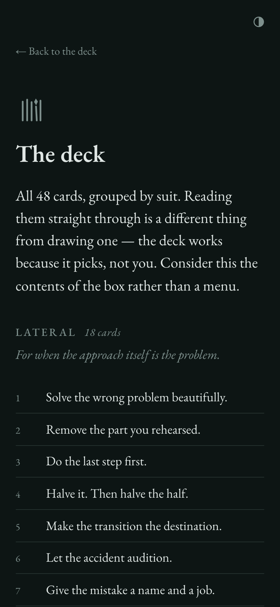

# Grasping Straws?

A single-purpose, mobile-first web app that deals one card at a time from an
original deck of lateral-thinking prompts, in the spirit of Brian Eno and
Peter Schmidt's Oblique Strategies. All card text here is original.

Tap, get a card, tap again. When the deadlock has a known shape, deal from a
single suit; when you'd rather be dealt to, there's [one card a day](/today/);
when there's more than one of you, the deck is [a game](/play/).

<p align="center">
  
  &nbsp;
  
  &nbsp;
  
</p>

## The look

The card is constant; the room changes. A real card's stock doesn't shift
colour with the lighting, so `--card` and `--card-ink` are the same warm
paper in both themes and only the ground moves — pale stone by day, deep
slate at night. That is what makes the card read as a lit object rather
than a panel, and it's the one place the design spends any boldness.
Everything else is deliberately quiet.

The card is cut to `11 / 19` — 0.579, the exact tarot ratio of the
physical deck (2.75″×4.75″), so the thing on screen has the proportions of
the thing in the box. Face down it wears a printed frame; face up it's
plain paper. Both states come from one `:has()` rule, so the draw screen,
`/today/` and `/c/<id>/` all agree without a line of JavaScript.

Themes use CSS `light-dark()`, which means one definition per token and a
toggle that only has to flip `color-scheme` on `<html>`.

Built with [Astro](https://astro.build) as a fully static site. The built
output ships **zero framework JavaScript** — just the ~2 KB draw script,
inlined into the page.

## Editing the deck

Edit **`public/cards.json`** and nothing else. It's an array of
`{ "id": 1, "text": "…", "suit": "lateral" }` objects:

- `id` must be unique and stable — it's what `#17`-style deep links and the
  `/c/17/` share pages point at.
- `text` is the card.
- `suit` groups cards by the shape of the deadlock (`lateral`, `sound`,
  `image`, `language`, `threshold`). The draw screen offers the suits as a
  quiet filter once a visitor has drawn; cards without a suit only appear
  when drawing from everything.

Removed cards vanish from visitors' in-progress decks automatically; added
cards join at their next reshuffle. When an editing pass lands, bump
`DECK_VERSION` in `src/config.ts` so the site and the printed deck stay in
lockstep.

## Configuration

`src/config.ts` holds the site constants, baked in at build time:

- `DECK_NAME` — the display name. The `?` is part of the mark; designed
  contexts (masthead, card back, titles) keep it, running prose drops it, and
  technical identifiers use `grasping-straws`.
- `PHYSICAL_DECK_URL` — leave `""` for the built-in "coming soon" state;
  set it to the product page URL once the physical deck exists.
- `DECK_VERSION` — shown discreetly on the About page.

The mark (straw bundle) has a single vector source: `public/favicon.svg`.
Both pages render it from there via CSS `mask`, so editing the glyph means
editing one file.

## Developing

```sh
npm install
npm run dev        # dev server with live reload
npm run build      # static build into dist/
npm run preview    # serve the built site
npm run check      # typecheck the client scripts and the .astro pages
npm run format     # prettier (see .prettierignore for the two exceptions)
npm run validate   # lint public/cards.json and the rules-card guard
npm run verify     # drive the built site end to end (build + serve first)
npm run smoke      # boot the dev server and check it serves every route
npm run assets     # regenerate og.png + PWA icons from favicon.svg
npm run print      # render 300 DPI card faces into print/ (see below)
npm run pnp        # regenerate public/print-and-play.pdf
```

## Print files (physical deck)

`npm run print` renders all 54 faces — 48 prompts, the 5 rules cards from
`/play/`, a title card — plus the shared back as 300 DPI PNGs into
`print/`, sized to the published tarot-card templates of both
MakePlayingCards and The Game Crafter (2.75″×4.75″ cut on a 900×1500 px
canvas; sources cited in `scripts/print-cards.js`). Run with `GUIDES=1` to
overlay the cut/safe outlines while proofing. **`docs/physical-deck.md` is
the ordering playbook** — printer routes, proof QA, and the go-live steps.

`npm run pnp` builds the free print-and-play edition:
`public/print-and-play.pdf`, the whole deck four-to-a-page with cut lines,
linked from the About page. Regenerate it whenever the deck changes.

## Deploying

Vercel auto-detects Astro; zero further config. Every push to `main`
rebuilds and deploys. When the real domain goes live, update `site` in
`astro.config.mjs` so `og:image` URLs point at it.

## How it works

- **The bag** (`src/scripts/app.ts`): the full deck is shuffled
  (Fisher–Yates, backed by `crypto.getRandomValues`) into a queue and dealt
  until empty — no repeats within a cycle, like a physical deck. The
  reshuffle guarantees the first card of a new bag differs from the last
  card dealt. Bag state persists in `localStorage`.
- **Suit decks**: a quiet row under the hint (visible after the first
  draw) rebuilds the bag from a single suit; the no-repeat cycle and the
  fresh-top rule apply inside the suit. The choice persists with the bag.
- **The daily card** (`/today/`): one deterministic card per calendar day —
  the visitor's local `YYYY-MM-DD`, FNV-1a hashed and then run through
  murmur3's finalizer, picks from the deck sorted by id. Same card for
  everyone sharing a date, no backend. The finalizer is load-bearing:
  FNV-1a on its own moves consecutive dates by a fixed stride, which would
  make tomorrow's card computable from today's.
- **Ways to play** (`/play/`): five original games — solo rituals, a duet,
  studio games. Condensed versions ship as the deck's printed rules cards,
  written once in `scripts/rules-cards.js` and rendered by both print
  scripts; `npm run validate` fails if that set stops matching the games
  on `/play/`.
- **The deck page** (`/deck/`): every card grouped by suit, built from
  `cards.json` at build time, no JavaScript. It exists so the physical
  deck has an evidence page — it's the contents of the box, deliberately
  a list rather than 48 pickable faces, because the deck works by
  choosing for you.
- **The tally**: how far into the current deck you are. The bag already
  behaves like a physical deck; this is the only place that's visible. It
  counts the bag rather than the draws, so it stays right across a
  reload, a suit change and a reshuffle.
- **Themes**: light (stone) and dark (slate) via `prefers-color-scheme`,
  both AA contrast, with a corner toggle cycling system → light → dark.
  "System" is the absence of a stored preference rather than a third
  stored value, so someone who never touches it keeps following their OS
  forever. An inline blocking script in `<head>` sets the attribute
  before first paint — the one thing on the site that can't be deferred.
- **Share links**: every draw sets `location.hash` to the card id; loading
  `/#17` shows card 17 face up, then rejoins the normal bag.
- **Sharing**: once a card is face up, a quiet "share this card" control
  appears in the hint's line — the native share sheet where the platform
  has one, copy-to-clipboard otherwise. It hands out `/c/17/`-style URLs:
  one static page per card, built from `cards.json` at build time, with the
  card text in the title and OG tags so shared links preview the card
  itself (`#`-fragments never reach link scrapers). Each page invites the
  visitor to draw their own.
- **Motion**: the card flip is the only animation; `prefers-reduced-motion`
  swaps it for a fast crossfade.
- **Offline**: a small service worker (`public/sw.js`) precaches the stable
  URLs and caches everything else as it streams through; Astro's hashed
  asset names mean bundles can never go stale. No third-party requests, no
  analytics, no backend.

## CI

`.github/workflows/ci.yml` runs on every PR: validates `public/cards.json`
and the rules cards, typechecks (`astro check` for the pages, `tsc` for the
client scripts), builds, smoke-tests the dev server, then drives the built
site in headless Chromium
(`scripts/verify.js`) — 83 checks covering the full-cycle no-repeat
guarantee, the reshuffle rule, persistence, deep links, the share flow,
per-card pages, the deck page, the tally, the theme toggle's full cycle
(including that the choice is applied before first paint), reduced
motion, and the no-third-party-requests rule. It also asserts the card
stays well clear of the ground in contrast, so the object can't quietly
flatten back into a panel.

`scripts/smoke-dev.js` covers the one thing that suite structurally
cannot. Everything else tests the _built_ output, which is correct — the
dev server injects the Astro toolbar and skews the request and size
checks — but it means dev-only configuration goes unexercised. A bad
Vite `optimizeDeps` entry, for instance, leaves `npm run build` and
`npm run check` both green while `npm run dev` is dead. The smoke test
boots the real dev server, asks it for every route, and fails on anything
it logs as a resolution failure. If you already have `npm run dev` open
it tests that server and leaves it running, rather than fighting Astro's
one-server-per-project rule.

## Licenses

Code is GPL-3.0 (see `LICENSE`). The EB Garamond fonts in `public/fonts/`
are under the SIL Open Font License (see `public/fonts/OFL.txt`).
