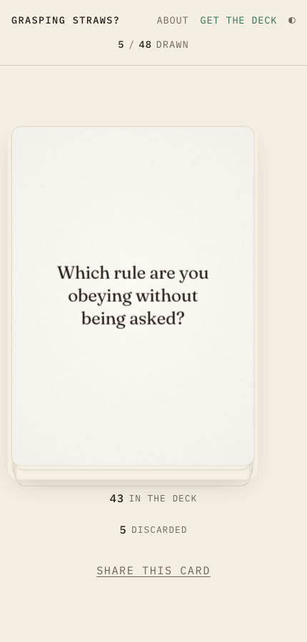
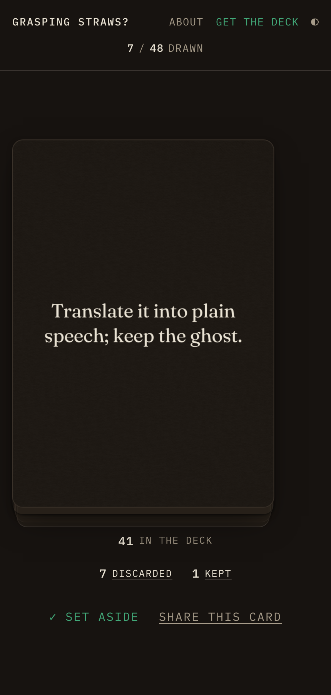

# Grasping Straws?

A single-purpose, mobile-first web app that deals one card at a time from an
original deck of lateral-thinking prompts, in the spirit of Brian Eno and
Peter Schmidt's Oblique Strategies. All card text here is original.

Tap, get a card, tap again.

<p align="center">
  
  &nbsp;&nbsp;
  
</p>

Built with [Astro](https://astro.build) as a fully static site. The built
output ships **zero framework JavaScript** — the draw script, a hand-rolled
WebGL paper shader and the theme toggle come to ~6 KB gzipped together,
inlined into the page. No framework, no animation library, no gesture
library, no third-party requests at runtime.

The card is a real object rather than a picture of one: a two-faced 3D flip
with 3px of stock and lit side edges, a fragment shader that generates the
paper fibre and tracks the specular to the card's live rotation, and a tilt
that follows your pointer at rest so the sheet catches light as you move.
You can throw it — drag and release and it lunges the way you flicked,
turning over as it goes.

It behaves like a deck you own. Cards deal from a pile that thins, land on a
discard that thickens, and either pile can be **picked up and looked
through**; any card you set aside stays on a shelf across sessions. All of it
degrades — the shader falls back to a CSS grain layer, and
`prefers-reduced-motion` gets a plain crossfade.

## Editing the deck

Edit **`public/cards.json`** and nothing else. It's an array of
`{ "id": 1, "text": "…", "suit": "lateral" }` objects:

- `id` must be unique and stable — it's what `#17`-style deep links, the
  `/c/17/` share pages, and the number printed on the physical card all
  point at.
- `text` is the card. Use typographic quotes (`’`), not `'` — validation
  enforces it, because at 24pt on card stock the difference is obvious.
- `suit` groups the deck on [`/deck/`](https://straws.lscaturchio.xyz/deck/),
  which is the only place a visitor sees it — the drawn card never names its
  suit, and neither does the printed card. A new suit needs a one-line
  description in `BLURB` in `src/pages/deck.astro`; without one its cards
  still list, just unannotated.
- `draft: true` reserves an id without publishing it. Drafts are filtered
  out of the dealt deck and get no share page, and `npm run print` refuses
  to run while any remain. They exist because MakePlayingCards prints tarot
  decks in fixed tiers and the deck has to reach one — see
  [docs/printing.md](docs/printing.md).

Removed cards vanish from visitors' in-progress decks automatically; added
cards join at their next reshuffle. When an editing pass lands, bump
`DECK_VERSION` in `src/config.ts` so the site and the printed deck stay in
lockstep.

## Configuration

`src/config.ts` holds the site constants, baked in at build time:

- `DECK_NAME` — the display name. The `?` is part of the mark; designed
  contexts (masthead, card back, titles) keep it, running prose drops it, and
  technical identifiers use `grasping-straws`.
- `PHYSICAL_DECK_URL` — leave `""` for the built-in "coming soon" state;
  set it to the product page URL once the physical deck exists.
- `DECK_VERSION` — shown discreetly on the About page.

The mark (straw bundle) has a single vector source: `public/favicon.svg`.
Both pages render it from there via CSS `mask`, so editing the glyph means
editing one file.

## Developing

```sh
npm install
npm run dev        # dev server with live reload
npm run build      # static build into dist/
npm run preview    # serve the built site
npm run check      # typecheck the client script
npm run validate   # lint public/cards.json
npm run verify     # drive the built site end to end (build + serve first)
npm run assets     # regenerate og.png + PWA icons from favicon.svg
npm run print      # render 300 DPI print files into print/final/ (see below)
npm run pnp        # render the free print-and-play PDF into public/
npm run pnp:check  # is the committed PDF still in step with cards.json?
npm run validate:rules  # do /play/ and the printed rules cards list the same games?
```

## Print files (physical deck)

`npm run print` renders all 54 faces, the shared back and a contact sheet
into `print/final/` at **897 × 1497 px, 300 DPI** — MakePlayingCards'
published tarot upload size, taken from their own FAQ rather than a
third-party template. The script self-checks that figure and refuses to run
if it drifts, if any card is still a draft, or if the face count isn't one
of MPC's tiers. It also measures every face as it renders and fails if any
text crosses the safe line, which is the mistake that costs a reprint.

`PROOF=1 npm run print` renders the unwritten slots stamped UNWRITTEN into a
separate directory so layout can be checked before the writing is done.
`GUIDES=1` overlays the bleed and safe outlines.

Full ordering steps, including what is still unresolved about the tuck box:
**[docs/printing.md](docs/printing.md)**.

### The free print-and-play edition

`npm run pnp` renders `public/print-and-play.pdf` — the live deck plus the
five rules cards, four to a US Letter page at true tarot size, with cut
lines, a cover of instructions and a page of backs. Unlike the manufactured
run it renders while cards are still drafts (a home print is not permanent)
and it carries the rules cards, which the manufactured deck does not: 54
faces is exactly one of MPC's tiers and five more would break it.

The PDF is committed, which is unusual for a generated file and deliberate:
the site is static and the host has no browser, so it cannot be rendered on
request. `scripts/pnp-stamp.json` records a hash of its inputs and
`npm run pnp:check` fails CI if the cards move on without it.

## Pages

| Path | What it is |
|---|---|
| `/` | the draw screen |
| `/today/` | one card a day, the same for everyone sharing a date, picked client-side from the local date |
| `/play/` | five games — the rules that turn a prompt deck into a card deck |
| `/deck/` | every live card grouped by suit; the contents of the box, no JavaScript |
| `/c/<id>/` | one static share page per card, with the text in the title and OG tags |
| `/about/` | what the deck is and where it comes from |

## Deploying

Live at **[straws.lscaturchio.xyz](https://straws.lscaturchio.xyz)**
(grasping-straws.vercel.app serves too; canonical tags point at the
subdomain). Vercel auto-detects Astro; every push to `main` rebuilds and
deploys. The domain rides lscaturchio.xyz's Cloudflare wildcard, so the
subdomain needed no DNS work — Vercel routes it by Host header. If the
domain ever changes, `site` in `astro.config.mjs` is the only source:
og:image, canonicals, sitemap.xml and robots.txt all derive from it. The
printed deck carries the URL too — `scripts/print-cards.js`.

## How it works

- **The bag** (`src/scripts/app.ts`): the full deck is shuffled
  (Fisher–Yates, backed by `crypto.getRandomValues`) into a queue and dealt
  until empty — no repeats within a cycle, like a physical deck. The
  reshuffle guarantees the first card of a new bag differs from the last
  card dealt. Bag state persists in `localStorage`.
- **Share links**: every draw sets `location.hash` to the card id; loading
  `/#17` shows card 17 face up, then rejoins the normal bag.
- **Sharing**: once a card is face up, a quiet "share this card" control
  appears in the hint's line — the native share sheet where the platform
  has one, copy-to-clipboard otherwise. It hands out `/c/17/`-style URLs:
  one static page per card, built from `cards.json` at build time, with the
  card text in the title and OG tags so shared links preview the card
  itself (`#`-fragments never reach link scrapers). Each page invites the
  visitor to draw their own.
- **Themes**: light (paper-warm) and dark (near-black), following
  `prefers-color-scheme` by default with a masthead toggle that overrides it
  and persists. Both AA contrast, including the green accent.
- **Type**: Fraunces for the card face and prose, IBM Plex Mono for the
  masthead, tally and labels. Sizes are set by *apparent* size — the two
  families have different x-heights (0.436 and 0.516), so they get separate
  ramps, and a check fails the build if anything renders under ~11.5px
  apparent.
- **The piles**: the deck thins and the discard thickens as you work through
  a cycle. Both can be picked up — a native `<dialog>` spreads the cards out,
  newest on top, and clicking one turns it face up again without dealing.
  This is why the draw *order* is stored and not just the count; a visitor
  arriving with the old saved shape gets their discard reconstructed from
  what the bag is missing rather than reset to zero.
- **The shelf**: "set aside" keeps a card across cycles. It is a bookmark,
  not a removal — the card stays in play, so "how many are left" keeps
  meaning one thing.
- **Motion**: the flip, the throw, a per-word card reveal, pointer parallax
  on the resting card, scroll-driven About reveals (native
  `animation-timeline`, zero JS), hover choreography and a three-beat
  entrance. `prefers-reduced-motion` reduces all of it to a fast crossfade.
- **Offline**: a small service worker (`public/sw.js`) precaches the stable
  URLs and caches everything else as it streams through; Astro's hashed
  asset names mean bundles can never go stale. No third-party requests, no
  analytics, no backend.

## CI

`.github/workflows/ci.yml` runs on every PR: validates `public/cards.json`,
typechecks, builds, then drives the built site in headless Chromium
(`scripts/verify.js`, 133 checks) — full-cycle no-repeat guarantee,
the browsable piles, the shelf, the throw gesture, pointer parallax,
migration from the previous saved shape, reshuffle rule,
persistence, deep links, the share flow and per-card pages, themes,
reduced motion, and the no-third-party-requests rule.

## Licenses

Code is GPL-3.0 (see `LICENSE`). The Fraunces and IBM Plex Mono fonts in
`public/fonts/` are under the SIL Open Font License (see
`public/fonts/OFL.txt`).
